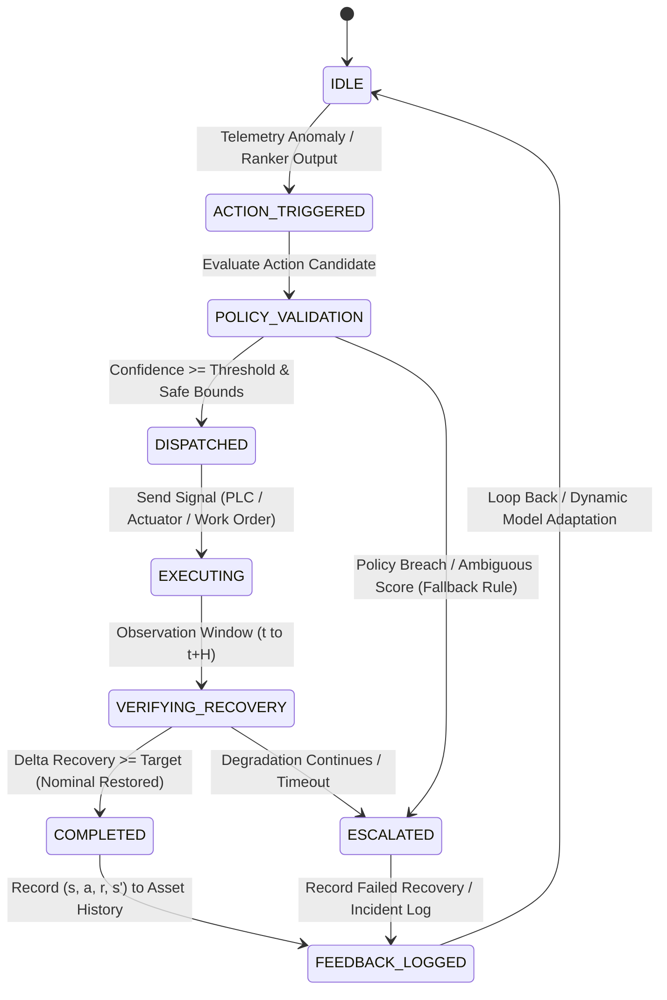

# Architecture and Workflow Specification

## 1. System Overview

The **Smart Manufacturing Multi-Agent System (MAS)** is an autonomous, closed-loop prescriptive maintenance platform for smart industrial operations. It combines deterministic multi-agent machine learning pipelines with learned ranking algorithms, local feature explainability, and an autonomous execution state machine.

```
[Telemetry Ingestion] ──► [Dynamic Analysis] ──► [Learned Recommender (LGBMRanker + CF)]
        ▲                                                    │
        │                                                    ▼
[State & Outcome Feedback] ◄── [Automated Action Execution] ◄── [Explainability Layer (SHAP + CBR)]
```

---

## 2. Evolution: Last Semester (Sem 6) vs. This Semester (Sem 7)

| Dimension | Last Semester (Sem 6) | Proposed This Semester (Sem 7 Pivot) |
| :--- | :--- | :--- |
| **System Loop** | **Open-loop** (terminates at advisory CSV/JSON report) | **Closed-loop** (Prediction $\rightarrow$ Ranking $\rightarrow$ Simulated Execution $\rightarrow$ Feedback) |
| **Operator Involvement** | **Heavy HITL gates** at every pipeline stage | **Autonomous execution** with automated safety fallbacks |
| **Action Generation** | Static heuristic rules & keyword matching (`_action_plan_from_score`) | **Learned Recommender** (`LGBMRanker` + Collaborative Filtering) |
| **Cross-Asset Signal** | None (assets scored individually) | **Cosine similarity** over multi-sensor archetypes |
| **Action Justification** | Generic canned template strings | **Dual-pillar explainability** (Local `TreeSHAP` + Case-Based Reasoning) |
| **Evaluation Metrics** | Standard ML metrics ($R^2$, Accuracy, MSE) | **RecSys & Economic metrics** ($\text{NDCG@k}$, $\text{Precision@k}$, Net Cost-Saved) |

---

## 3. Three-Tier Intelligence Hierarchy

```
┌─────────────────────────────────────────────────────────────────────────────┐
│  TIER 1 — Cloud LLM (Gemini 2.5-Flash)                                     │
│  Strategic Orchestration OR Reflexion Summary                               │
│  • Reasons about complete workflow state                                    │
│  • Reflexion loop: Draft → Self-Critique → Revised Narrative Summary        │
│  • Generates human-auditable executive reports from structured outputs      │
├─────────────────────────────────────────────────────────────────────────────┤
│  TIER 2 — Local SLM (Qwen3:4B via Ollama / LlamaCpp)                      │
│  Tactical Edge Parameter Optimization (Retained Position)                   │
│  • Analyzes outlier fractions and feature distributions at the edge         │
│  • Recommends IsolationForest contamination and estimator parameters        │
│  • Zero cloud dependency for factory edge deployment                        │
├─────────────────────────────────────────────────────────────────────────────┤
│  TIER 3 — Rule-Based ToolDecider                                            │
│  Deterministic Decisions — Zero Latency, Zero Hallucination Risk           │
│  • Missing value imputation strategy (SimpleImputer vs. KNNImputer)         │
│  • Numerical scaling strategy (StandardScaler vs. RobustScaler)             │
│  • Initial model family dispatch (Linear, Tree-based, SVM, Ensemble)        │
└─────────────────────────────────────────────────────────────────────────────┘
```

---

## 4. Core Autonomous Closed-Loop Components

### A. Collaborative-Filtering-Augmented Learned Recommender
Replaces static if-else keyword heuristics with a learning-to-rank engine:
1. **Query Formulation**: Predictions and telemetry states are grouped per asset incident as queries $q = (\text{Machine\_ID}, t)$.
2. **Candidate Action Space**: Structured maintenance actions $\mathcal{A} = \{\text{Lubricate Bearing}, \text{Recalibrate Sensor}, \text{Throttle Workload}, \text{Replace Subcomponent}, \text{Emergency Shutdown}, \text{Monitor}\}$.
3. **LambdaMART (`LGBMRanker`)**: Optimizes candidate ranking against historical relevance labels derived from net cost reduction and recovery time ($\text{NDCG@k}$).
4. **Cross-Asset Collaborative Filtering**: Computes multi-sensor archetype cosine similarity $S(m_i, m_k) = \frac{\mathbf{v}_i \cdot \mathbf{v}_k}{\|\mathbf{v}_i\| \|\mathbf{v}_k\|}$ to transfer historical maintenance success rates from nearest peer machines.
5. **Deterministic Cold-Start Fallback**: Zero-history assets automatically fall back to deterministic safety heuristics.

---

### B. Self-Explaining Interpretability Layer
Audits autonomous decisions to prevent black-box failures:

```
                      ┌─────────────────────────────────────────┐
                      │       Top-Ranked Action Candidate       │
                      └────────────────────┬────────────────────┘
                                           │
                 ┌─────────────────────────┴─────────────────────────┐
                 ▼                                                   ▼
┌─────────────────────────────────┐                 ┌─────────────────────────────────┐
│    1. Quantitative Feature      │                 │     2. Empirical Precedent      │
│          Attribution            │                 │       (Case-Based CBR)          │
│          (Local SHAP)           │                 │                                 │
├─────────────────────────────────┤                 ├─────────────────────────────────┤
│ • TreeSHAP on LGBMRanker        │                 │ • Multi-sensor cosine distance  │
│ • Local feature contributions   │                 │ • Nearest neighbor recovery log │
│ • Captures non-linear           │                 │ • Empirical success rate and    │
│   interactions (Vibr. + Fails)  │                 │   downtime outcomes             │
└────────────────┬────────────────┘                 └────────────────┬────────────────┘
                 │                                                   │
                 └─────────────────────────┬─────────────────────────┘
                                           ▼
                      ┌─────────────────────────────────────────┐
                      │      LLM Reflexion Synthesis & Audit    │
                      │     (Machine-readable + Human audit)    │
                      └─────────────────────────────────────────┘
```

*   **Quantitative Pillar (`TreeSHAP`)**: Calculates local Shapley values $\phi_i(x, a)$ for every sensor feature to explain non-linear compound risks (e.g. moderate vibration paired with high past failures).
*   **Empirical Pillar (Case-Based Reasoning)**: Retrieves the top-$K$ most similar historical incidents across peer assets to provide real-world precedents (*"In 3 historical incidents with similar vibration/duty-cycle profiles, executing Action X restored nominal efficiency in 3.5 hours"*).
*   **Reflexion Synthesis**: Formats SHAP attributions and CBR precedents into auditable compliance summaries.

---

### C. Autonomous Execution State Machine Engine



1. **Policy Validation**: Verifies candidate actions against operational constraints, downtime limits, and confidence thresholds ($\tau_{\text{exec}}$).
2. **Action Dispatch**: Programmatically dispatches control adjustments or generates automated maintenance tickets.
3. **Recovery Verification**: Monitors telemetry over observation horizon $H$ and computes physical delta recovery:
   $$\Delta \text{Recovery} = \|\mathbf{x}_{t} - \mathbf{x}_{\text{nominal}}\| - \|\mathbf{x}_{t+H} - \mathbf{x}_{\text{nominal}}\|$$
4. **Closed-Loop Feedback Store**: Persists state-action-reward transition tuples $(s_t, a_t, r_t, s_{t+1})$ to update ranker models and collaborative filtering weights dynamically.

---

## 5. Web Application Architecture (`webapp/`)

```
Browser UI (Vanilla JS) ◄── Polling (/api/run/{id}) ──► FastAPI Backend (app.py)
                                                              │
                                                              ▼
                                                     RunManager Worker Thread
                                                              │
                    ┌─────────────────────────────────────────┼─────────────────────────────────────────┐
                    ▼                                         ▼                                         ▼
            DataLoaderAgent                           DynamicAnalysisAgent                      OptimizationAgent
          (Schema & Profiling)                     (Pretrained / Live Models)                (Ranking & Explainability)
                    │                                         │                                         │
                    └─────────────────────────────────────────┴─────────────────────────────────────────┘
                                                              │
                                                              ▼
                                                   Artifacts & State Files
                                                   (artifacts/web_runs/{id})
```

*   **`webapp/app.py`**: REST API endpoints for dataset uploads, run creation, status polling, synthetic data generation, and artifact streaming.
*   **`webapp/run_manager.py`**: Threaded execution state machine managing pipeline progress, log capture, and JSON state persistence.
*   **`webapp/static/app.js`**: Reactive frontend with dynamic stage indicators, result cards, and artifact downloads.
